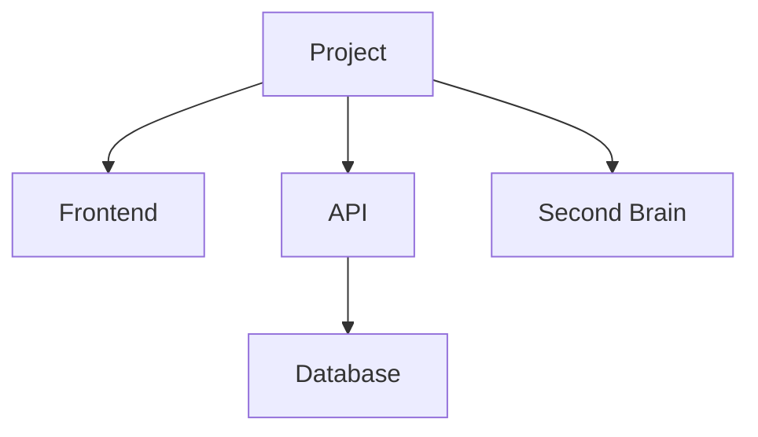

# PROJECT.md

> Canonical project brief and current status. This file is written for humans, LLMs, dashboards, APIs, and Second Brain ingestion.

## Project identity

- Name:
- Short name / slug:
- Domain:
- Area:
- Visibility:
- Owner:
- Collaborators:
- Repository:
- Canonical project file:
- Agent rules file:
- Production URL:
- Dashboard URL:
- API base URL:
- Second Brain page:
- Language / style:

## One-line description

One sentence that explains the project clearly to someone seeing it for the first time.

## Core idea

Explain the base concept of the project: what it is, why it exists, what problem or possibility it addresses, and what makes it distinct.

This section should be stable enough to help any LLM understand the project without reading the whole repository.

## Context and background

Describe the origin, history, artistic/professional/family context, and any important previous versions or legacy lines.

Include links to source documents, prior systems, public pages, references, or Second Brain pages.

## Timeline

- YYYY: 
- YYYY: 

## Audience and users

- Primary users:
- Secondary users:
- Internal users:
- Public audience:

## Scope

### In scope

- 

### Out of scope

- 

## Current status

Short status paragraph: what works today, what is being built now, what is blocked, and what changed recently.

Use concrete dates when useful.

## Canonical principles and invariants

List the principles that should survive refactors, ports, redesigns, dashboard changes, and LLM interventions.

- 

## Active fronts

### Front 1

- Status:
- Purpose:
- Current work:
- Next step:

### Front 2

- Status:
- Purpose:
- Current work:
- Next step:

## Product / system map

Describe the main modules, screens, packages, APIs, dashboards, databases, external services, and data flows.

## Documentation map

List the documents future humans or LLMs should read for deeper context.

| Document | Purpose | Status |
|----------|---------|--------|
|  |  |  |

## Technical overview

- Runtime / framework:
- Language(s):
- Database:
- Authentication:
- Hosting:
- External APIs:
- Build command:
- Dev command:
- Test command:

## Data and API contract

List the important resources, endpoints, schemas, files, or exports that describe the state of the project.

- Resource:
- Source of truth:
- Consumer:
- Notes:

## Dashboard / API status

- Dashboard exists:
- Dashboard URL:
- API exists:
- API base URL:
- API maturity:
- Useful endpoints for Second Brain:
- Missing endpoints:

## Publication / access model

- Public surface:
- Private/internal surface:
- Auth model:
- Commercial model:
- Licensing:

## Second Brain integration

- Areas:
- Projects:
- Systems:
- Visibility:
- Related wiki pages:
- Related journal entries:
- Related CRM people:
- What should be exported to Second Brain:
- What should stay only in the app/repository:

## Current roadmap

### Now

- [ ] 

### Next

- [ ] 

### Later

- [ ] 

## Recent decisions

| Date | Decision | Reason | Link |
|------|----------|--------|------|
| YYYY-MM-DD |  |  |  |

## Known risks and constraints

- 

## Open questions

- 

## Operating notes

Short notes for humans and LLMs working in this project: local setup quirks, naming rules, design constraints, important conventions, or common mistakes.

## Maintenance protocol

- Update this file when the project direction, architecture, active fronts, roadmap, API surface, deployment, or status changes materially.
- Keep the `Core idea` stable unless the project identity changes.
- Keep the `Current status`, `Active fronts`, `Current roadmap`, `Recent decisions`, and `Open questions` fresh.
- When an LLM makes a meaningful change, it should update this file or explicitly say why no update was needed.
- Project-level status automation may update this file from recent commits, task changes, docs, roadmap changes, and API/dashboard changes.
- Second Brain aggregation may read this file as the source of truth for central project summaries and dashboards.

## Links

- 
