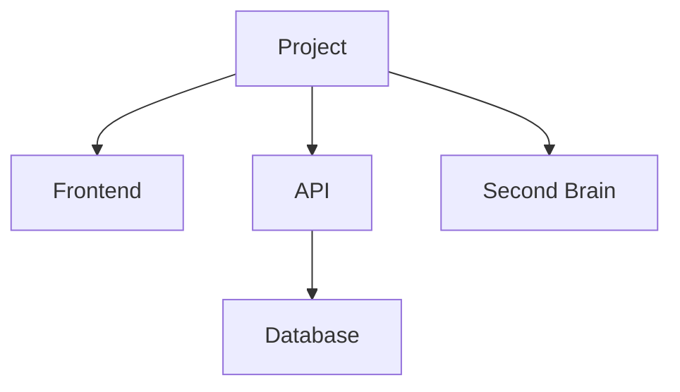

# PROJECT.md

> Canonical project brief and current status. This file is written for humans, LLMs, dashboards, APIs, and Second Brain ingestion.

## Project identity

- Name:
- Short name / slug:
- Domain:
- Area:
- Visibility:
- Owner:
- Collaborators:
- Repository:
- Canonical project file:
- Canonical project ID:
- Canonical backend: `repo_project_md` / `second_brain` / `olab_dashboard`
- This file role: `canonical` / `working_copy` / `snapshot`
- Canonical version (when external):
- Agent rules file:
- Google Drive parent:
- Google Drive parent ID:
- Google Drive asset folder:
- Google Drive asset folder ID:
- Production URL:
- Dashboard URL:
- API base URL:
- Second Brain page:
- Language / style:

## One-line description

One sentence that explains the project clearly to someone seeing it for the first time.

## Core idea

Explain the base concept of the project: what it is, why it exists, what problem or possibility it addresses, and what makes it distinct.

This section should be stable enough to help any LLM understand the project without reading the whole repository.

## Context and background

Describe the origin, history, artistic/professional/family context, and any important previous versions or legacy lines.

Include links to source documents, prior systems, public pages, references, or Second Brain pages.

## Timeline

- YYYY:
- YYYY:

## Audience and users

- Primary users:
- Secondary users:
- Internal users:
- Public audience:

## Scope

### In scope

-

### Out of scope

-

## Current status

> **Mandatory operational snapshot.** Keep these labels exactly as written so
> humans, agents, dashboards and APIs can read the same contract.

- Operational status: `idea` / `planned` / `active` / `waiting` / `blocked` / `complete` / `archived`
- Status updated: `YYYY-MM-DD`
- Current status summary:
- Primary next step:
- Primary owner:
- Due date: `YYYY-MM-DD` / none
- Waiting on: none

`Current status summary` is a concise statement of what is true now: what
works, what is being built or validated, and the material constraint. It is
not the stable project description and not a session log.

`Primary next step` is the single action that should move the project forward
next. It must match the first actionable entry in **Priorities and next
steps**. Use concrete dates when useful.

## Priorities and next steps

> **Mandatory operational section** in every `PROJECT.md`. This is the live point-of-situation list — not a historical dump.
>
> Update it on **session open** and **session closeout** (and whenever a priority is completed, blocked, cancelled, or replaced mid-session if Rui asks).
>
> Keep the list short and actionable. Move finished work to a “Recently done” subsection or to the session/history log; do not let completed items clutter the active list forever.

### Active now

1. **Priority —** Owner:
   - Why / outcome:
   - Next concrete action:
   - Status: `active` / `blocked` / `waiting`

2. **Priority —** Owner:
   - Why / outcome:
   - Next concrete action:
   - Status:

### Waiting / blocked

-

### Recently done (session boundary)

- YYYY-MM-DD —

### Operational consistency rule

- `Primary next step` in **Current status** equals the `Next concrete action`
  of the first actionable priority above.
- If the project is `waiting` or `blocked`, `Waiting on` names the dependency
  and the first priority explains the follow-up or unblock action.
- `Status updated` changes only when this operational snapshot changes
  materially; it is not automatically the file modification date.

## Canonical principles and invariants

List the principles that should survive refactors, ports, redesigns, dashboard changes, and LLM interventions.

-

## Active fronts

### Front 1

- Status:
- Purpose:
- Current work:
- Next step:

### Front 2

- Status:
- Purpose:
- Current work:
- Next step:

## Product / system map

Describe the main modules, screens, packages, APIs, dashboards, databases, external services, and data flows.

## Documentation map

List the documents future humans or LLMs should read for deeper context.

| Document | Purpose | Status |
|----------|---------|--------|
|  |  |  |

## Technical overview

- Runtime / framework:
- Language(s):
- Database:
- Authentication:
- Hosting:
- External APIs:
- Build command:
- Dev command:
- Test command:

## Data and API contract

List the important resources, endpoints, schemas, files, or exports that describe the state of the project.

- Resource:
- Source of truth:
- Consumer:
- Notes:

## Dashboard / API status

- Dashboard exists:
- Dashboard URL:
- API exists:
- API base URL:
- API maturity:
- Useful endpoints for Second Brain:
- Missing endpoints:

## OLAB Development artifacts

> Preencher em **todos** os projectos OLAB (OCUBO-OLAB). O dashboard (Presente → Development) mostra TECH SPECS, TECH DIAGRAM e 3D VIRTUAL VENUE a partir destes dados + catálogos em `tools/`.

- **Installation ID** (ex. `02`, `06`, `18`):
- **OLAB project number** (ex. `133` Serralves 2026):
- **Dashboard row / slug**:

| Artefacto | Estado | Fonte canónica | Registo dashboard |
|-----------|--------|----------------|-------------------|
| **TECH SPECS** | `missing` / `draft` / `active` | Google Sheet tab: | Tab gerida pelo dashboard; skill `olab-tech-specs-sheets` |
| **Tech diagram** | `missing` / `draft` / `active` | `docs/cad_reference/<ficheiro>.py` · SVG: | `tools/api/cad-editor/registry.json` · `editorId`: · `techDiagramCatalog.ts` |
| **3D virtual venue** | `missing` / `draft` / `active` | `c4d/` · `glb/` · Drive: | `virtualVenueCatalog.ts` · Sketchfab: |

Notas por artefacto:

- **TECH SPECS:** spreadsheet ID, nome da tab, última sync sheet ↔ `PROJECT.md`, política hardware-only.
- **Tech diagram:** tipo (potência, instalação, áudio, …), data última regeneração SVG, `revisionNumber` no catálogo.
- **3D virtual venue:** ficheiro C4D/Rhino principal, export GLTF, URL Sketchfab (se publicado), o que vive só em Drive.

Drive sidecar (assets pesados): ver campos *Google Drive* em *Project identity* e `Second Brain/00 Meta/OLAB Drive Folder Linking.md`.

### Procurement LED (modulos com batch partilhado)

Se o modulo participa num batch LED agregado noutro repo (ex. SEL26 hub em `SEL26_06_eucaliptos`):

- **Nao** duplicar estado de pagamento/expedicao como fonte independente.
- Manter secção **Procurement LED (espelho — canónico em `…`)** com tabela resumo + `Última sync:`.
- Actualizar o espelho apenas após mudanca material no hub, em session closeout.

## Publication / access model

- Public surface:
- Private/internal surface:
- Auth model:
- Commercial model:
- Licensing:

## Second Brain integration

- Areas:
- Projects:
- Systems:
- Visibility:
- Related wiki pages:
- Related journal entries:
- Related CRM people:
- What should be exported to Second Brain:
- What should stay only in the app/repository:

## Current roadmap

### Now

- [ ]

### Next

- [ ]

### Later

- [ ]

## Recent decisions

| Date | Decision | Reason | Link |
|------|----------|--------|------|
| YYYY-MM-DD |  |  |  |

## Project log

Short, durable session and milestone log. Record what changed in the project state, why it matters, and the resulting next direction. Do not copy every commit.

- YYYY-MM-DD —

## Known risks and constraints

-

## Open questions

-

## Operating notes

Short notes for humans and LLMs working in this project: local setup quirks, naming rules, design constraints, important conventions, or common mistakes.

## Maintenance protocol

- Update this file when the project direction, architecture, active fronts, roadmap, API surface, deployment, or status changes materially.
- Keep the `Core idea` stable unless the project identity changes.
- Keep the `Current status`, `Active fronts`, `Current roadmap`, `Recent decisions`, and `Open questions` fresh.
- Keep the exact `Current status` labels and the operational consistency rule;
  dashboards may parse them without interpreting prose.
- Review `Operational status`, `Current status summary`, `Primary next step`,
  `Status updated`, and the first actionable priority together.
- Keep `Project log` concise and append material session boundaries or milestones.
- Respect `Canonical backend` and `This file role`: a `working_copy` or `snapshot` must never overwrite a newer canonical version without conflict resolution.
- During normal development, LLM agents should not update this file mid-session. They should review and update it during session closeout if the completed work changed project direction, architecture, active fronts, roadmap, API surface, deployment, decisions, risks, or status materially.
- If no `PROJECT.md` update is needed at closeout, the agent should explicitly say why.
- Recurring hygiene or status scans may report that this file appears stale, but should not rewrite it automatically unless Rui explicitly asks for a maintenance-only update.
- Second Brain aggregation may read this file as the source of truth for central project summaries and dashboards.

## Links

-
