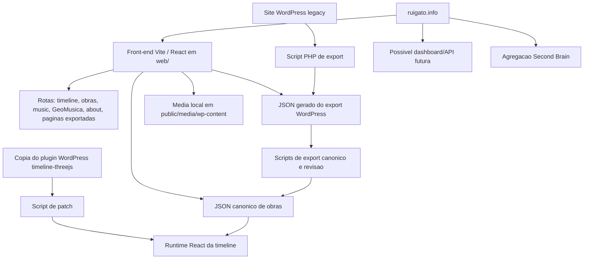

# PROJECT.md

> Documento canónico do projecto e do seu estado actual, escrito para pessoas, LLMs, dashboards, APIs e ingestão pelo Second Brain.

## Project identity

- Name: ruigato.info
- Short name / slug: ruigato-info
- Domain: ruigato.info
- Area: site público, arquivo editorial, portfolio, identidade artística
- Visibility: site público, com possibilidade futura de áreas privadas ou mistas de dashboard
- Owner: Rui Gato
- Collaborators: não definidos formalmente neste repositório
- Repository: `/Users/ruigato/Documents/GitHub/ruigato.info`
- Canonical project file: `docs/PROJECT.md`
- Agent rules file: `AGENTS.md`
- Production URL: `https://ruigato.info`
- Dashboard URL: não definido
- API base URL: não definido
- Second Brain page: área `public/ruigato-info`; provavelmente relacionada com `[[wiki/sources/ruigato.info PROJECT]]`
- Language / style: português europeu, preferencialmente pré-Acordo Ortográfico para documentação de projecto; o conteúdo público do site mistura português e inglês conforme as fontes.

## One-line description

`ruigato.info` é o site público e arquivo editorial de Rui Gato, apresentando o seu trabalho como músico, sound artist, geometer, colaborador, performer, tutor e construtor de sistemas audiovisuais.

## Core idea

O projecto é o arquivo público e portfolio de Rui Gato, cobrindo trabalho interdisciplinar em música, arte sonora, teatro, performance, video mapping, instalação interactiva, motion graphics, 3D, tutoria e GeoMusica.

Não deve ser tratado apenas como um portfolio convencional de objectos acabados. O site existe para sustentar um mapa vivo de obras, séries, colaborações, contextos, edições, identidade pública e linhas de investigação. O centro do projecto está no cruzamento entre som, espaço, imagem, performance, tecnologia e composição.

A direcção técnica actual é um novo front-end em Vite/React que recria e expande material exportado do site WordPress anterior, mantendo dados WordPress e media legado como fontes quando necessário.

## Context and background

O projecto parte de um site WordPress existente, anteriormente alojado externamente. O repositório contém agora um novo front-end em `web/`, feito com Vite e React, pensado para correr localmente e poder ser exposto através de Cloudflare Tunnel para `ruigato.info` e `www.ruigato.info`.

O WordPress não é alterado por este projecto. É usado como fonte legacy através de exports e espelhos locais de media. O front-end tem dados JSON gerados, dados canónicos de obras, overrides editoriais, traduções, tratamento de media e uma versão adaptada de um plugin WordPress de timeline integrada na app React.

A identidade pública actualmente representada pelo site inclui:

- Rui Gato como "musician, sound artist, geometer"
- música e composição em tempo real
- arte sonora e instalação
- teatro e performance interdisciplinar
- video mapping, pixel mapping, luz e sistemas audiovisuais públicos
- motion graphics, 3D e imagem sintética
- tutoria, residências, laboratórios e workshops
- GeoMusica como investigação, ferramenta, projecto e sistema composicional

Fontes consultadas neste repositório:

- `AGENTS.md`
- `README.md`
- `web/README.md`
- `docs/init.md`
- `web/src/data/site.json`
- `web/src/data/worksCanonical.json`
- `web/public/data/canonical/works-index.json`

## Timeline

- Antes de 2026: existe site público WordPress em `ruigato.info`.
- 2026-05: o repositório contém front-end Vite/React, scripts de export WordPress, pipeline canónica de obras, integração da timeline, editor editorial de obras e documentação do projecto.

## Audience and users

- Primary users: visitantes públicos, curadores, colaboradores, instituições, festivais, investigadores e pessoas à procura do trabalho de Rui Gato.
- Secondary users: Rui Gato e futuros colaboradores que mantenham o arquivo.
- Internal users: Rui Gato, agentes LLM e possíveis sistemas futuros de dashboard/API.
- Public audience: pessoas interessadas em música, arte sonora, performance, sistemas audiovisuais, teatro, mapping, GeoMusica e colaborações relacionadas.

## Scope

### In scope

- Portfolio e arquivo público.
- Timeline de obras e eventos.
- Índice de obras, obras destacadas e páginas individuais de obra.
- Páginas About, Music, GeoMusica, Links, Contact e páginas legacy exportadas.
- Pipeline canónica de obras a partir de material exportado do WordPress.
- Tratamento local de media legacy em `wp-content`.
- Apoio editorial e edição de obras no front-end Vite.
- Documentação que ajude humanos e LLMs a compreender a identidade, o modelo de dados e o estado actual do site.

### Out of scope

- Publicar informação privada de família, finanças, saúde, credenciais, estado não publicado de projectos ou material interno sensível de OCUBO/OLAB.
- Tratar material privado do Second Brain como conteúdo público por omissão.
- Alterar directamente a instalação WordPress a partir deste projecto de front-end.
- Assumir a existência de API, dashboard, base de dados, autenticação ou deployment de produção antes de estarem implementados.

## Current status

- Operational status: active
- Status updated: 2026-07-27
- Current status summary: O arquivo React/Vite e o pipeline editorial de 257 obras estão disponíveis. A frente activa retomada é seleccionar os projectos OCUBO/OLAB dos últimos sete anos que devem entrar no site público; a publicação continua dependente da conclusão dos textos finais no OLAB Dashboard.
- Primary next step: Seleccionar no OLAB Dashboard os projectos OCUBO/OLAB dos últimos sete anos que devem entrar no site e identificar os textos finais ainda em falta.
- Primary owner: Rui
- Due date: none
- Waiting on: Conclusão dos textos finais dos projectos seleccionados no OLAB Dashboard antes da publicação.

## Priorities and next steps

### Active now

1. **Priority — Seleccionar o arquivo OLAB recente** Owner: Rui
   - Why / outcome: definir o conjunto editorial que deve representar os últimos sete anos de trabalho.
   - Next concrete action: Seleccionar no OLAB Dashboard os projectos OCUBO/OLAB dos últimos sete anos que devem entrar no site e identificar os textos finais ainda em falta.
   - Status: `active`
2. **Priority — Rever a apresentação pública** Owner: Rui
   - Next concrete action: rever a qualidade editorial e a apresentação pública do conjunto seleccionado antes de o publicar.
   - Status: `planned`
3. **Priority — Clarificar a governação dos conteúdos** Owner: Rui
   - Next concrete action: documentar a relação canónica entre dados do site, conteúdo editorial e textos finais do OLAB Dashboard.
   - Status: `planned`

## Canonical principles and invariants

- Manter a identidade editorial pública separada de material privado de dashboard ou Second Brain.
- Preservar o site como arquivo interdisciplinar, não apenas como portfolio linear.
- Tratar o contexto como parte de cada obra: colaboração, instituição, festival, cidade, ferramenta e série importam.
- Preservar a coexistência de música, teatro, instalação, mapping, sistemas visuais, tutoria e GeoMusica.
- Manter pipelines geradas/canónicas separadas de alterações editoriais manuais, excepto quando a tarefa pedir explicitamente essa ponte.
- Não publicar material privado ou sensível sem pedido explícito.
- Usar `docs/PROJECT.md` como brief canónico e ficheiro de estado do projecto.
- Seguir as convenções Vite/React existentes em `web/`.

## Active fronts

### Public front-end

- Status: activo
- Purpose: apresentar o site público e arquivo através de uma interface React/Vite moderna.
- Current work: existem no código timeline inicial, arquivo de obras, obras destacadas, música, GeoMusica, about, páginas exportadas e detalhe de obra.
- Next step: verificar paridade pública e qualidade editorial face à superfície desejada para `ruigato.info`.

### Canonical works pipeline

- Status: activo
- Purpose: transformar export WordPress e material legacy em registos canónicos de obras para o front-end.
- Current work: existem dados canónicos JSON, ficheiros públicos por obra, metadata de revisão, fontes de tradução, lotes de tradução e scripts de media/rewrite/cópia.
- Next step: clarificar regras de fonte de verdade para dados gerados, overrides, edições manuais e exports futuros.

### Timeline integration

- Status: activo
- Purpose: preservar a timeline visual do plugin WordPress `timeline-threejs` dentro da nova app React.
- Current work: existem cópia raw do plugin, script de patch, runtime wrapper e construtor de dados da timeline.
- Next step: manter a cópia raw do plugin e o runtime gerado sincronizados quando o plugin WordPress mudar.

### Editorial editor

- Status: presente no código
- Purpose: apoiar edição e gravação local de dados canónicos de obras a partir do front-end durante desenvolvimento.
- Current work: existem painel de editor, contexto de autenticação do editor, cliente de gravação e plugin Vite de gravação.
- Next step: definir quem deve usar este editor, como gerir segredos e se isto é apenas desenvolvimento ou início de um dashboard privado.

### Hosting and tunnel

- Status: parcialmente documentado
- Purpose: servir o front-end local através de `ruigato.info` e `www.ruigato.info`.
- Current work: README e scripts `.bat` referem Cloudflare Tunnel e servidor Vite local na porta 80.
- Next step: documentar detalhes confirmados de operação sem expor credenciais ou informação sensível.

## Product / system map

## Documentation map

| Document | Purpose | Status |
|----------|---------|--------|
| `AGENTS.md` | Regras para agentes LLM neste repositório | Versão local inicial, não versionada no momento desta escrita |
| `docs/PROJECT.md` | Brief canónico e estado do projecto | Versão inicial baseada no template |
| `README.md` | Entrada de setup e nota sobre alojamento local/Cloudflare | Presente |
| `web/README.md` | Setup do front-end, build, export de conteúdo, media e timeline | Presente |
| `docs/init.md` | Registo inicial de conversa sobre migração WordPress/alojamento local | Presente |
| `.agents/templates/PROJECT.md Template.md` | Template local usado para este ficheiro | Presente |
| `web/src/data/worksTextTranslations/README.md` | Notas para lotes de tradução de textos de obras | Presente |

## Technical overview

- Runtime / framework: Vite, React
- Language(s): TypeScript, JavaScript, JSON, script PHP de export
- Database: nenhuma na app React; o WordPress legacy usa MySQL/MariaDB fora deste repositório
- Authentication: não há autenticação pública confirmada; o editor local usa `VITE_WORK_EDITOR_SECRET` quando activo
- Hosting: servidor Vite local na porta 80 para desenvolvimento/tunnel; build estática em `web/dist/`
- External APIs: nenhuma API pública obrigatória confirmada; scripts e dados podem referir media WordPress e dados de galerias Flickr
- Build command: `cd web && npm run build`
- Dev command: `cd web && npm run dev`
- Test command: não há comando dedicado de testes; existe `npm run lint`

## Data and API contract

- Resource: `web/src/data/works.json`
- Source of truth: export gerado do WordPress através de `scripts/export-wp-to-json.php`
- Consumer: loaders do front-end e pipeline canónica
- Notes: deve ser tratado como dado exportado, não como fonte editorial manual por omissão.

- Resource: `web/src/data/pages.json`
- Source of truth: export gerado do WordPress
- Consumer: rotas de páginas exportadas e corpo opcional da página inicial
- Notes: actualmente pequeno; a rota dinâmica `/p/{slug}` mostra páginas exportadas.

- Resource: `web/src/data/timeline-events.json`
- Source of truth: dados gerados/exportados para timeline
- Consumer: construtor de dados da timeline
- Notes: actualmente 257 itens.

- Resource: `web/src/data/worksCanonical.json`
- Source of truth: saída da pipeline canónica de obras, com overrides/review relevantes
- Consumer: páginas de obras, detalhe de obra, obras destacadas, música e apresentação relacionada com GeoMusica
- Notes: actualmente 257 itens.

- Resource: `web/public/data/canonical/works-index.json` e `web/public/data/canonical/works/*.json`
- Source of truth: script de export canónico
- Consumer: superfície estática pública de dados canónicos
- Notes: o commit mais recente adicionou 257 ficheiros JSON por obra.

- Resource: `web/src/data/worksCanonicalOverrides.json`
- Source of truth: camada manual/editorial de overrides
- Consumer: pipeline de normalização/export canónico de obras
- Notes: a governação exacta dos overrides ainda deve ser clarificada.

- Resource: `web/src/data/worksCanonicalReview.json`
- Source of truth: metadata de revisão editorial
- Consumer: helpers de revisão editorial e editor
- Notes: útil para assinalar registos incompletos ou incertos.

- Resource: `web/src/data/worksTextTranslationSources/*.json` e `web/src/data/worksTextTranslations/*.json`
- Source of truth: scripts/fontes de tradução e ficheiros de tradução
- Consumer: tratamento de textos localizados de obras
- Notes: existe workflow por lotes.

- Resource: `/wp-content/...` e `/media/wp-content/...`
- Source of truth: espelho local de media WordPress ou media copiado para o front-end
- Consumer: servidor Vite e URLs públicas de media
- Notes: `LEGACY_WP_CONTENT_DIR` controla a fonte local; o valor por omissão está orientado a Windows/XAMPP.

## Dashboard / API status

- Dashboard exists: não confirmado
- Dashboard URL: não definido
- API exists: não confirmado
- API base URL: não definido
- API maturity: não existe contrato API para além de JSON estático e do plugin Vite de gravação em desenvolvimento
- Useful endpoints for Second Brain: nenhum confirmado; JSON canónico estático pode tornar-se fonte útil
- Missing endpoints: estado do projecto, índice de obras, detalhe de obra, estado editorial, sumários de dashboard e exports seguros para Second Brain são candidatos futuros

## Publication / access model

- Public surface: site público `ruigato.info`, incluindo timeline, obras, obras destacadas, música, GeoMusica, about, links, contact e páginas exportadas seleccionadas
- Private/internal surface: áreas futuras de dashboard ou editor são possíveis, mas não estão definidas
- Auth model: não definido para produção; existe segredo local para o plugin de gravação do editor
- Commercial model: não definido
- Licensing: não definido

## Second Brain integration

- Areas: `public/ruigato-info`
- Projects: ruigato.info
- Systems: possível agregação futura de estado de projecto/dashboard
- Visibility: só devem ser exportados sumários públicos e seguros, salvo pedido explícito em contrário
- Related wiki pages: `[[wiki/entities/Rui Gato]]`, `[[wiki/sources/ruigato.info PROJECT]]`, `[[wiki/syntheses/Trabalho de Rui Gato]]`, `[[wiki/syntheses/Arquitectura Second Brain APIs e dashboards]]`
- Related journal entries: não identificadas
- Related CRM people: não identificadas
- What should be exported to Second Brain: resumo público do projecto, estado actual, roadmap, perguntas abertas, taxonomia editorial pública e links seguros para ficheiros-fonte
- What should stay only in the app/repository: credenciais, material privado familiar/profissional, detalhes não publicados de projectos, informação interna de OCUBO/OLAB e detalhes locais de tunnel que exponham segredos

## Current roadmap

### Now

- [ ] Confirmar se o front-end Vite/React é já a superfície pública activa pretendida.
- [ ] Validar timeline, obras, obras destacadas, music, GeoMusica, about, links e contact contra o site público desejado.
- [ ] Clarificar governação dos dados canónicos: export gerado, export canónico, overrides, ficheiros de revisão e gravações do editor.
- [ ] Documentar detalhes seguros do tunnel/runbook local.

### Next

- [ ] Definir se o editor de obras é apenas de desenvolvimento ou início de um dashboard privado.
- [ ] Decidir quando e como regenerar JSON canónico após alterações no WordPress/export.
- [ ] Estabelecer uma checklist leve de QA para publicação pública.
- [ ] Decidir que campos de estado devem sincronizar para o Second Brain.

### Later

- [ ] Considerar uma API pública ou privada se JSON estático não for suficiente.
- [ ] Considerar um dashboard de estado de projectos criativos, profissionais, pessoais e familiares, mantendo material privado separado do site público.
- [ ] Decidir se o WordPress continua como fonte legacy, arquivo, ou se é retirado totalmente do workflow de conteúdo.

## Recent decisions

| Date | Decision | Reason | Link |
|------|----------|--------|------|
| 2026-05-24 | Usar este `docs/PROJECT.md` baseado no template como brief canónico e ficheiro de estado. | Alinhar o repositório com `AGENTS.md` e o template local. | `.agents/templates/PROJECT.md Template.md` |
| 2026-05 | Construir e expandir um front-end Vite/React em vez de editar directamente o WordPress. | O README e `web/README.md` descrevem o novo front-end e dizem que o WordPress não é alterado por este projecto. | `README.md`, `web/README.md` |
| 2026-05 | Manter exports WordPress e media legacy como inputs do novo front-end. | O repositório inclui scripts de export WordPress, dados canónicos, rewrite de media e integração de plugin de timeline. | `web/README.md` |
| 2026-05 | Servir desenvolvimento local na porta 80 e opcionalmente expor via Cloudflare Tunnel. | O README raiz e o Vite config documentam a porta fixa e hosts permitidos para `ruigato.info`. | `README.md`, `web/vite.config.ts` |

## Known risks and constraints

- Desenvolvimento na porta 80 pode colidir com outros serviços locais e pode exigir permissões elevadas nalguns sistemas.
- O caminho legacy de media por omissão no código está orientado a Windows/XAMPP.
- Dados gerados, dados canónicos e overrides manuais podem divergir se as regras de regeneração não forem claras.
- O site público não deve absorver acidentalmente material privado do Second Brain ou informação sensível familiar/profissional.
- Cloudflare Tunnel/alojamento local significa que a disponibilidade pública pode depender de uma máquina local ligada.
- Não há suite dedicada de testes automatizados definida.
- O repositório contém muitos dados canónicos gerados; alterações futuras devem evitar churn ruidoso quando possível.

## Open questions

- O front-end Vite/React é já o site de produção pretendido, ou ainda é uma camada de paridade/protótipo ao lado do WordPress?
- Qual é o caminho exacto de produção: servidor Vite local, build estática `web/dist/`, outro host estático, ou outro servidor?
- Que ficheiros são a fonte editorial de verdade das obras: export WordPress, `worksCanonical.json`, JSON público por obra, overrides, ou output gravado pelo editor?
- O editor local de obras deve alguma vez estar disponível fora de desenvolvimento?
- Que fronteira público/privado deve existir se houver dashboard futuro?
- Que páginas do Second Brain devem ser actualizadas automaticamente quando este ficheiro mudar materialmente?
- Que termos de licenciamento e reutilização se aplicam a texto, imagens, áudio, vídeo e dados canónicos gerados?
- Que colaboradores ou relações institucionais devem aparecer em metadata de projecto, e com que grau de detalhe?
- Qual é a QA mínima antes de expor alterações através de `ruigato.info`?

## Operating notes

Antes de fazer alterações, ler `AGENTS.md`, este ficheiro, `README.md`, `web/README.md` em trabalho de front-end, e os ficheiros directamente relacionados com a tarefa.

Para desenvolvimento front-end, trabalhar dentro de `web/` e usar os comandos de `web/package.json`. Os scripts mais relevantes são `npm run dev`, `npm run build`, `npm run lint`, `npm run export-canonical`, `npm run build-text-translation-sources`, `npm run migrate-pt-export-typos`, `npm run strip-canonical-description-meta` e `npm run dedupe-canonical-media`.

Manter trabalho editorial público separado de material privado de dashboard ou Second Brain. Em alterações significativas, actualizar este ficheiro quando a direcção do projecto, frentes activas, roadmap, contrato de dados, deployment ou superfície editorial pública mudarem materialmente.

## Maintenance protocol

- Actualizar este ficheiro quando a direcção do projecto, arquitectura, frentes activas, roadmap, superfície API, deployment ou estado mudarem materialmente.
- Manter `Core idea` estável salvo mudança de identidade do projecto.
- Manter `Current status`, `Active fronts`, `Current roadmap`, `Recent decisions` e `Open questions` frescos.
- Quando um LLM fizer uma alteração significativa, deve actualizar este ficheiro ou dizer explicitamente por que motivo não foi necessário.
- Automação de estado de projecto pode actualizar este ficheiro a partir de commits recentes, mudanças de tarefas, docs, roadmap e alterações de API/dashboard.
- Agregação Second Brain pode ler este ficheiro como fonte de verdade para sumários centrais de projecto e dashboards.

## Links

- `https://ruigato.info`
- `https://www.ruigato.info`
- `AGENTS.md`
- `README.md`
- `web/README.md`
- `.agents/templates/PROJECT.md Template.md`
- `/Users/ruigato/Documents/GitHub/secondBrain/Second Brain/00 Meta/Project Registry.md`
